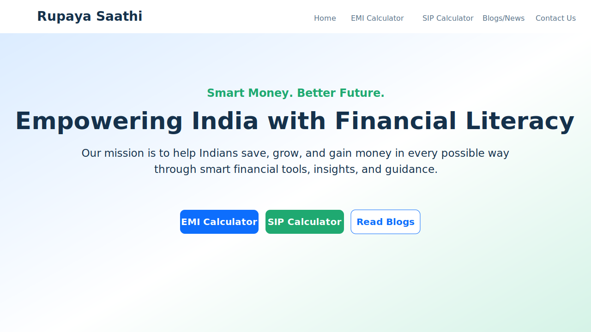

# Rupaya Saathi

A multi-page financial website built with pure HTML, CSS, and JavaScript.

## Demo Screenshot



## Project Structure

```
/
├── index.html
├── calculators.html
├── calculators/
│   ├── emi.html
│   ├── sip.html
│   ├── fd.html
│   ├── lumpsum.html
│   ├── loan-eligibility.html
│   └── inflation.html
├── blogs.html
├── blog-save-10000.html
├── blog-sip-vs-fd.html
├── blog-budgeting.html
├── contact.html
├── style.css
├── script.js
└── assets/
    └── demo-home.svg
```

## Features

- Shared responsive navbar across all pages.
- Dedicated calculators hub page with card layout.
- Six financial calculators with interactive result cards.
- Blue + green fintech design with Poppins font.
- Mobile responsive layout and hover animations.
- Pure HTML/CSS/JS (no frameworks).

## Run locally

```bash
python3 -m http.server 4173
```

Open: `http://127.0.0.1:4173/index.html`
